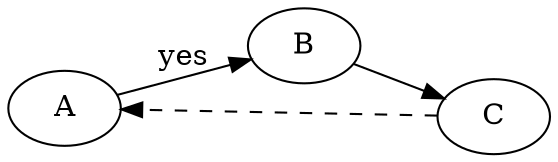

# Syntax Highlighting Test

This file is used to verify the coloring of fenced code blocks in the HTML preview
of **MDTextEditor**. Each block uses the language name after the triple backticks
(e.g. ` ```delphi `) and contains keywords, comments, strings, numbers and operators,
so that every highlighter attribute can be checked visually.

It covers **all** the languages mapped by the syntax-highlighting emitter. At the
bottom you will also find the *fallback* cases: an unknown language and a block with
no language (they must stay monospace, not colored, with no errors).

---

# Popular languages

## Pascal / Delphi (`delphi`, `pascal`, `pas`)

```delphi
unit Demo.SyntaxTest;

interface

uses
  System.SysUtils, System.Classes;

type
  // A simple class with a property and a method
  TCounter = class(TObject)
  private
    FValue: Integer;
  public
    constructor Create(const AStart: Integer = 0);
    function Increment(AStep: Integer): Integer;
    property Value: Integer read FValue;
  end;

implementation

const
  MAX_VALUE = 1000;          { hex and float below }
  PI_APPROX = 3.14159;
  MASK = $FF00;

function TCounter.Increment(AStep: Integer): Integer;
begin
  if (FValue + AStep) <= MAX_VALUE then
    FValue := FValue + AStep
  else
    raise Exception.CreateFmt('Overflow: %d', [FValue]);
  Result := FValue;
end;

end.
```

## Delphi Form (`dfm`)

```dfm
object MainForm: TMainForm
  Left = 0
  Top = 0
  Caption = 'Demo'
  ClientHeight = 480
  ClientWidth = 640
  object Button1: TButton
    Left = 24
    Top = 16
    Width = 75
    Caption = 'OK'
    TabOrder = 0
  end
end
```

## DWScript (`dws`)

```dws
// DWScript: Pascal-like scripting
var total : Float = 0.0;
for var i := 1 to 10 do
  total += i * 1.5;
PrintLn('Total = ' + FloatToStr(total));
```

## C / C++ (`cpp`, `c`)

```cpp
#include <iostream>
#include <vector>

// Template function with a default parameter
template <typename T>
T clamp(const T& v, const T& lo, const T& hi) {
    return (v < lo) ? lo : (v > hi ? hi : v);
}

int main(int argc, char** argv) {
    std::vector<int> data = { 1, 2, 0xFF, 42, -7 };
    long total = 0L;
    for (const auto& n : data)
        total += n;                 /* accumulate */
    std::cout << "Total = " << total << '\n';
    return total > 100 ? 1 : 0;
}
```

## C# (`cs`, `csharp`)

```cs
using System;
using System.Linq;

namespace Demo
{
    public record Person(string Name, int Age);

    public static class Program
    {
        public static void Main()
        {
            var people = new[] { new Person("Alice", 30), new Person("Bob", 25) };
            foreach (var p in people.Where(p => p.Age >= 18))
                Console.WriteLine($"{p.Name} is {p.Age}");
            const double Rate = 0.075;   // 7.5%
        }
    }
}
```

## JavaScript / TypeScript (`js`, `ts`)

```js
// Fetch data and compute a sum
const API = "https://example.com/api";

async function loadTotals(ids = []) {
  const results = await Promise.all(
    ids.map((id) => fetch(`${API}/item/${id}`).then((r) => r.json()))
  );
  return results.reduce((acc, item) => acc + (item.price ?? 0), 0);
}

const ok = /^[a-z0-9_]+$/i.test("user_123");
console.log(`valid = ${ok}`, 3.14, true, null);
```

## JSON (`json`)

```json
{
  "name": "markdown-tools",
  "version": "2.8.0",
  "enabled": true,
  "ratio": 0.85,
  "tags": ["editor", "preview", "shell"],
  "author": null
}
```

## Python (`python`, `py`)

```python
import math
from dataclasses import dataclass


@dataclass
class Circle:
    """A circle with a radius."""
    radius: float = 1.0

    def area(self) -> float:
        # area = pi * r^2
        return math.pi * self.radius ** 2


if __name__ == "__main__":
    c = Circle(2.5)
    print(f"area = {c.area():.3f}", 0xCAFE, True, None)
```

## SQL (`sql`)

```sql
-- Report of top customers
SELECT c.id, c.name, SUM(o.total) AS total_spent
FROM   customers AS c
LEFT   JOIN orders AS o ON o.customer_id = c.id
WHERE  c.active = 1
  AND  o.created_at >= '2026-01-01'
GROUP  BY c.id, c.name
HAVING SUM(o.total) > 1000.50
ORDER  BY total_spent DESC;
```

## Java (`java`)

```java
package com.example.demo;

import java.util.List;

public class Demo {
    public static void main(String[] args) {
        final double TAX = 0.22;
        List<Integer> nums = List.of(3, 1, 0xA, 42, -5);
        int sum = nums.stream().filter(n -> n > 0).mapToInt(Integer::intValue).sum();
        System.out.printf("sum=%d tax=%.2f%n", sum, TAX); // done
    }
}
```

## PHP (`php`)

```php
<?php
declare(strict_types=1);

// Simple invoice calculator
class Invoice
{
    private float $taxRate = 0.22;
    public function __construct(private array $lines = []) {}
    public function total(): float
    {
        $net = array_reduce($this->lines, fn($c, $l) => $c + $l['qty'] * $l['price'], 0.0);
        return $net * (1 + $this->taxRate);
    }
}
printf("Total: %.2f\n", (new Invoice([['qty' => 2, 'price' => 9.99]]))->total());
```

## HTML (`html`)

```html
<!DOCTYPE html>
<html lang="en">
<head>
  <meta charset="utf-8" />
  <title>Demo &amp; Test</title>
  <!-- a comment -->
</head>
<body>
  <h1 id="main" class="title">Hello, World!</h1>
  <a href="https://example.com">link</a>
</body>
</html>
```

## XML (`xml`)

```xml
<?xml version="1.0" encoding="UTF-8"?>
<!-- configuration -->
<config version="2">
  <setting name="dark" value="true" />
  <paths>
    <path>C:\Temp</path>
  </paths>
</config>
```

## CSS (`css`)

```css
/* Theme variables and a rule */
:root {
  --accent: #f36d33;
  --gap: 1.5rem;
}

.button:hover {
  background-color: var(--accent);
  border: 1px solid rgba(0, 0, 0, 0.2);
  transition: all 0.2s ease-in-out;
}
```

## INI (`ini`)

```ini
; Application configuration
[General]
Name = Markdown Tools
Version = 2.8.0
DarkMode = true

[Editor]
FontSize = 11   # inline comment
```

## Batch (`bat`, `cmd`)

```bat
@echo off
REM Build helper
setlocal enabledelayedexpansion
set "CONFIG=release"
for %%F in (*.dproj) do (
    echo Building %%F [!CONFIG!]
    msbuild.exe "%%F" /p:config=%CONFIG%
)
endlocal
```

## YAML (`yaml`, `yml`)

```yaml
# Application configuration
name: markdown-tools
version: 2.8.0
enabled: true
tags:
  - editor
  - preview
limits:
  maxFiles: 100
anchor: &default
  retries: 3
use_default: *default
```

---

# Additional SynEdit highlighters

## Perl (`perl`, `pl`)

```perl
#!/usr/bin/perl
use strict;
use warnings;

my @nums = (1, 2, 3, 0xFF);
my $total = 0;
foreach my $n (@nums) {
    $total += $n;   # accumulate
}
print "Total = $total\n";
```

## Ruby (`ruby`, `rb`)

```ruby
# A small class
class Greeter
  def initialize(name)
    @name = name
  end

  def greet
    puts "Hello, #{@name}!"   # interpolation
  end
end

Greeter.new("World").greet
nums = [1, 2, 3].map { |x| x * 2 }
```

## Haskell (`haskell`, `hs`)

```haskell
-- Factorial and a sum
module Main where

factorial :: Integer -> Integer
factorial 0 = 1
factorial n = n * factorial (n - 1)

main :: IO ()
main = do
  let xs = [1..10]
  print (sum xs)
  print (factorial 5)
```

## Fortran (`fortran`, `f90`)

```fortran
program demo
  implicit none
  integer :: i, total
  total = 0
  do i = 1, 10
    total = total + i   ! accumulate
  end do
  print *, "Total = ", total
end program demo
```

## COBOL (`cobol`)

```cobol
       IDENTIFICATION DIVISION.
       PROGRAM-ID. DEMO.
       DATA DIVISION.
       WORKING-STORAGE SECTION.
       01 WS-TOTAL    PIC 9(4) VALUE 0.
       PROCEDURE DIVISION.
           PERFORM VARYING WS-TOTAL FROM 1 BY 1
             UNTIL WS-TOTAL > 10
           END-PERFORM.
           DISPLAY "DONE".
           STOP RUN.
```

## Assembler (`asm`)

```asm
; sum two numbers
section .text
    global _start
_start:
    mov eax, 5        ; first operand
    add eax, 0x0A     ; add 10
    cmp eax, 15
    jne done
done:
    ret
```

## Visual Basic (`vb`, `vbnet`)

```vb
' A simple module
Module Demo
    Sub Main()
        Dim total As Integer = 0
        For i As Integer = 1 To 10
            total += i   ' accumulate
        Next
        Console.WriteLine("Total = " & total)
    End Sub
End Module
```

## VBScript (`vbs`, `vbscript`)

```vbscript
' VBScript demo
Dim total, i
total = 0
For i = 1 To 10
    total = total + i
Next
WScript.Echo "Total = " & total
```

## Tcl/Tk (`tcl`)

```tcl
# Tcl demo
proc factorial {n} {
    if {$n <= 1} { return 1 }
    return [expr {$n * [factorial [expr {$n - 1}]]}]
}
puts "5! = [factorial 5]"
```

## TeX / LaTeX (`tex`, `latex`)

```tex
\documentclass{article}
% preamble
\begin{document}
\section{Introduction}
Here is some math: $E = mc^2$ and a fraction $\frac{1}{2}$.
\end{document}
```

## Inno Setup (`inno`, `iss`)

```inno
; Inno Setup script
[Setup]
AppName=Demo App
AppVersion=1.0

[Files]
Source: "app.exe"; DestDir: "{app}"; Flags: ignoreversion

[Code]
function InitializeSetup(): Boolean;
begin
  Result := True;
end;
```

## Modelica (`modelica`)

```modelica
model Resistor "Ideal resistor"
  parameter Real R = 100 "Resistance";
  // Ohm's law
  Real v, i;
equation
  v = R * i;
end Resistor;
```

## Eiffel (`eiffel`)

```eiffel
class
    GREETER
feature -- Access
    greet (name: STRING)
            -- Print a greeting.
        do
            print ("Hello, " + name + "%N")
        end
end
```

## REXX (`rexx`)

```rexx
/* REXX demo */
total = 0
do i = 1 to 10
    total = total + i
end
say "Total =" total
```

## KiXtart (`kix`)

```kix
; KiXtart demo
$total = 0
For $i = 1 to 10
    $total = $total + $i
Next
? "Total = " + $total
```

## IDL (`idl`)

```idl
// Interface definition
interface Calculator {
    long add(in long a, in long b);
    double divide(in double a, in double b) raises (DivByZero);
};
```

## Web IDL (`webidl`)

```webidl
// Web IDL interface
[Exposed=Window]
interface Rectangle {
  attribute double width;
  attribute double height;
  double area();
};
```

## Baan (`baan`)

```baan
| Baan 3GL demo
function extern long sum.range(long a, long b)
{
    long total
    for total = a ; total <= b ; total++
    endfor
    return(total)
}
```

## Cache ObjectScript (`cache`)

```cache
 ; Cache ObjectScript demo
 set total = 0
 for i = 1:1:10 {
     set total = total + i
 }
 write "Total = ", total, !
```

## CP/M (`cpm`)

```cpm
; CP/M batch
A>DIR *.COM
A>TYPE README.TXT
A>PIP B:=A:DEMO.COM
```

## DML (`dml`)

```dml
-- DML demo
SELECT name, value
  FROM settings
 WHERE active = 1;
```

## Graphviz DOT (`dot`, `graphviz`)



## FoxPro (`foxpro`)

```foxpro
* FoxPro demo
LOCAL lnTotal
lnTotal = 0
FOR lnI = 1 TO 10
    lnTotal = lnTotal + lnI   && accumulate
ENDFOR
? "Total = " + TRANSFORM(lnTotal)
```

## Galaxy (`galaxy`)

```galaxy
; Galaxy demo
total = 0
loop i = 1 to 10
    total = total + i
end
print "Total = ", total
```

## GW-Script (`gws`)

```gws
// GW-Script demo
var total = 0;
for (i = 1; i <= 10; i = i + 1) {
    total = total + i;
}
print("Total = " + total);
```

## LLVM IR (`llvm`, `ll`)

```llvm
; LLVM IR demo
define i32 @add(i32 %a, i32 %b) {
entry:
  %sum = add i32 %a, %b
  ret i32 %sum
}
```

## LDraw (`ldraw`, `ldr`)

```ldraw
0 Simple brick model
0 Name: demo.ldr
1 4 0 0 0 1 0 0 0 1 0 0 0 1 3001.dat
1 15 0 24 0 1 0 0 0 1 0 0 0 1 3003.dat
```

## Standard ML (`sml`)

```sml
(* Standard ML demo *)
fun factorial 0 = 1
  | factorial n = n * factorial (n - 1)

val result = factorial 5
val () = print ("5! = " ^ Int.toString result ^ "\n")
```

## Structured Text / Smalltalk (`st`)

```st
(* Structured Text demo *)
total := 0;
FOR i := 1 TO 10 DO
    total := total + i;
END_FOR;
```

## SDD (`sdd`)

```sdd
; SDD demo
total = 0
repeat i = 1 to 10
    total = total + i
end
```

## Windows Resource (`rc`)

```rc
// Resource script
#include "resource.h"

IDD_ABOUT DIALOGEX 0, 0, 200, 100
CAPTION "About"
BEGIN
    DEFPUSHBUTTON   "OK", IDOK, 75, 80, 50, 14
    LTEXT           "Demo 1.0", IDC_STATIC, 10, 10, 180, 8
END
```

## Unix Shell (`sh`, `bash`)

```sh
#!/bin/bash
# Build helper
CONFIG="release"
total=0
for f in *.dproj; do
    echo "Building $f [$CONFIG]"
    total=$((total + 1))
done
echo "Built $total projects"
```

## UnrealScript (`unrealscript`, `uc`)

```unrealscript
// UnrealScript demo
class Greeter extends Object;

function Greet(string Name)
{
    local int Count;
    Count = 0;
    `log("Hello, " $ Name);   // log macro
}
```

## ADSP-21xx (`adsp21xx`, `adsp`)

```adsp21xx
{ ADSP-21xx assembly }
.MODULE demo;
.VAR/DM total;
    AX0 = 5;
    AY0 = 10;
    AR = AX0 + AY0;     { add }
    DM(total) = AR;
.ENDMOD;
```

## CAC (`cac`)

```cac
; CAC demo
total = 0
for i = 1 to 10
    total = total + i
next
```

---

# Fallback cases

## Unknown language (`foobar`)

Must stay monospace and **uncolored** (no highlighter associated), with no errors:

```foobar
this is some text in an unknown language
key: value & <tag> "quoted"  123
```

## No language

This one must stay monospace and uncolored as well:

```
plain code block, no language specified
a < b && c > d   // not highlighted
```

## Inline code

An example of `inline code` inside a paragraph: it is not a fenced block, so it is
not processed by the emitter (it stays a plain `<code>`).
