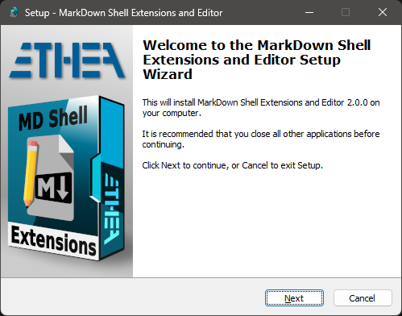

# Markdown Editor and Shell Extensions 

**Latest Version 2.3.0 - 28 Aug 2024**

**A collection of tools for markdown files, to edit and view content:**

- A **Markdown Text Editor** to manually edit a markdown file, with instant preview of the output in a HTML Viewer.

- A **Preview handler** which allows you to see the content of the markdown file without open it, in the "Preview Panel", integrated into Windows Explorer.

### Features

- No need to built the project with Delphi: an easy Setup is provided.

- Supports Windows Vista, 7, 8, 10 and 11 (for 32 bits and 64 bits).

- Themes (Dark and Light) according to user preferences of Windows Theme

- Integrated also with other Shell Applications (like XYplorer)

### Delphi: integration with MarkDown Help Viewer

- For Delphi developers: use this tool to prepare and integrate a Help System in your application, using the ["MarkDown Help Viewer"](https://github.com/EtheaDev/MarkdownHelpViewer) project.
- Use the **Markdown Text Editor** to edit your help files and use the **Markdown Help Viewer** to show them.

### Setup using the Installer

Click to download the [MDShellExtensionsSetup.exe][1] located also in the Release area. The Installer works both for 32 and 64 bit system.

***For a clean Setup close all the windows explorer instances which have the preview handler active or the preview handler was used (remember the dll remains in memory until the windows explorer was closed).***

### Markdown Text Editor

A useful Text editor with instant preview of Markdown formatted content:

### Manual Build and Installation (only for Delphi developers) ###

Learn more about the manual within our [wiki](https://github.com/EtheaDev/MarkdownShellExtensions/wiki/Manual-Build-and-Installation). Dive deeper into everything related to this tool, its features, and how to make the most of it.

### Preview Panel in action ###

In Windows 10 with Dark theme:

### Manual Build and Installation (only for Delphi developers) ###

If you have Delphi 12, you can manually build the projects using:

\Source\MDShellExtensionsGroup.groupproj

or the command: Build.bat (defining location of your Delphi environment)

***Warning: To simplyfy build of the projects, some third parties libraries are located into ext folder***

To manually install the SVGShellExtensions.dll follow these steps:

1. Close all the windows explorer instances which have the preview handler active or the preview handler was used (remember the dll remains in memory until the windows explorer was closed).
  
2. If you have already used the installer uninstall the components from system.
     
3. To install manually the dll run the `Unregister_Register.cmd` (run-as-administrator): notice that you must change the path into cmd file.

## Release Notes ##

28 Aug 2024: ver. 2.3.0
- Use of TFormTabsBar component (Delphi 12) for paging
- Use of Styled Message Dialogs
- Updated Setup to show errors registering dlls

28 May 2024: ver. 2.2.5
- File Changed notification and reload only when App has focus
- Small icons on Message Dialogs

23 May 2024: ver. 2.2.4
- Fixed Registration of dll extension during Setup
- Updated the latest Image32 library

21 May 2024: ver. 2.2.3
- Added Packages in External Sources
- Changed MessageDialogs with small animations
- Fixed Version number into Installer

10 May 2024: ver. 2.2.2
- Fixed Explorer Preview for Chinese chars
- Added use of StyledComponents and Rounded Buttons in Explorer Preview
- Fixed Initialization of GDI+

09 May 2024: ver. 2.2.1
- Added File Changed notification and reload
- Fixed Preview for Chinese chars
- Added use of StyledComponents and Rounded Buttons
- Built with Delphi 12.1
- Built with Latest Image32 Library
- Built with Latest Skia4Delphi 6.1 Library

20 Mar 2024: ver. 2.2.0
- Fixed resize content when changing Monitor
- Updated to latest version of HTMLViewer

13 Jan 2024: ver. 2.1.0
- Built with Delphi 12
- Updated Copyright
- Aligned to MarkDown HelpViewer project
- Added create table wizard

3 Nov 2023: ver. 2.0.2
- Added "mark" command in markdown toolbar
- Recognized 1) same as 1. (ordered list)
- Added .text and .txt extensions to editor/shell extensions

25 Oct 2023: ver. 2.0.1
- Fixed some "hints"
- Uses System Border and Shadows for Forms

24 Oct 2023: ver. 2.0.0
- Added use of Skia4Delphi
- Added support for new image format (webp and wbmp)
- Uses AnimatedStyledDialogs for messages
- Added toolbar for markdown commands
- Added dialog for input of hyperlink for Images and Files
- Updated Markdown library with best support for CommonMark transformation

1. Subscript text and Superscript text
1. Formulas (using [Google Chart API])
1. ==Markers==
1. [Reference-style Links]

29 Jun 2023: ver. 1.5.2
- Fixed loading images with "spaces" in the filename
- Fixed immediate-loading of new images when editing the file
- During loading of remote images, user can stop loading pressing "Esc"
- Updated Copyright for the Editor

26 Jun 2023: ver. 1.5.1
- Fixed Preview of Markdown files with extensions different from .markdown

24 Jun 2023: ver. 1.5.0
- Autoload local markdown files when clicked into Preview
- The editor can open all markdown extensions: .md, .mkd, .mdwn, .mdown, .mdtxt, .mdtext, .markdown, .txt, .text'
- Stopped image rendering during editing to speed-up
- Added useful close button on Tabs
- Hint full filename on Tabs
- Save/Discard messaged default response inverted
- Removed Settings "Search In Folder"

1 Nov 2022: ver. 1.4.3
- Fixed loading images into Preview
- Fixed the setting for local loading

11 Set 2022: ver. 1.4.1
- Added Combobox for easy selection Markdown Dialect
- Added Windows 11 light and dark styles
- Fixed load file with blanks in content menu
- Fixed loading ANSI files
- Fixed AV in Settings with opened files

20 Jan 2022: ver. 1.3.0
- Added Support for Windows 11
- Fixed resize content

04 Sep 2021: ver. 1.2.0
- Added Support for Delphi 11
- Updated Image32 Lib

20 Jul 2021: ver. 1.1.0
- Added Image32 Lib to best rendering of SVG Images

06 Jul 2021
- First public release with setup

## Credits

Many thanks to **Rodrigo Ruz V.** (author of [theroadtodelphi.com][5] Blog) for his wonderful work on [delphi-preview-handler][6] from which this project has used a lot of code and inspiration.

## License

Licensed under the [Apache License, Version 2.0][2] (the "License");

Unless required by applicable law or agreed to in writing, software distributed under the License is distributed on an "AS IS" BASIS, WITHOUT WARRANTIES OR CONDITIONS OF ANY KIND, either express or implied. See the License for the specific language governing permissions and limitations under the License.

### Other libraries from Ethea:

**SVGIconImageList** - https://github.com/EtheaDev/SVGIconImageList/

**StyledComponents** - https://github.com/EtheaDev/StyledComponents

**Delphi MarkdownProcessor** - https://github.com/EtheaDev/MarkdownProcessor

### Third parties libraries:

**OpenSLL Library**: Cryptography and SSL/TLS Toolkit

Copyright © 1998-2018 The OpenSSL Project.  All rights reserved.

**Delphi Markdown** - https://github.com/grahamegrieve/delphi-markdown

Copyright (c) 2011+, Health Intersections Pty Ltd All rights reserved

**Delphi Preview Handler** - https://github.com/RRUZ/delphi-preview-handler

The Initial Developer of the Original Code is Rodrigo Ruz V.
Portions created by Rodrigo Ruz V. are Copyright © 2011-2023 Rodrigo Ruz V.

**SynEdit** - http://synedit.svn.sourceforge.net/viewvc/synedit/

all rights reserved.

**Synopse/SynPDF** - https://github.com/synopse/SynPDF

Copyright © Synopse: all right reserved.

**HtmlToPdf** - https://github.com/MuzioValerio/HtmlToPdf

Copyright © Muzio Valerio.

**Image32 Library** - http://www.angusj.com/delphi/image32/Docs/_Body.htm

Copyright ©2019-2023 Angus Johnson.

**dzlib** - https://sourceforge.net/projects/dzlib/

Copyright (c) Thomas Mueller

**HTMLViewer** - https://github.com/BerndGabriel/HtmlViewer

Copyright (c) 1995 - 2008 by L. David Baldwin

Copyright (c) 1995 - 2023 by Anders Melander (DitherUnit.pas)

Copyright (c) 1995 - 2023 by Ron Collins (HtmlGif1.pas)

Copyright (c) 2008 - 2009 by Sebastian Zierer (Delphi 2009 Port)

Copyright (c) 2008 - 2010 by Arvid Winkelsdorf (Fixes)

Copyright (c) 2009 - 2023 by HtmlViewer Team

# External projects

***To simpilfy compilation of projects they are added into ext folder***

[SVGIconImageList](https://github.com/EtheaDev/SVGIconImageList)

[HtmlViewer](https://github.com/BerndGabriel/HtmlViewer)

[vcl-styles-utils](https://github.com/RRUZ/vcl-styles-utils)

[markdownProcessor](https://github.com/EtheaDev/MarkdownProcessor)

[StyledComponents](https://github.com/EtheaDev/StyledComponents)

[dzlib](https://sourceforge.net/projects/dzlib/)

Related links: [embarcadero.com][3] - [learndelphi.org][4]

[1]: https://github.com/EtheaDev/MarkdownShellExtensions/releases/latest/download/MDShellExtensionsSetup.exe

[2]: https://opensource.org/licenses/Apache-2.0

[3]: https://www.embarcadero.com/

[4]: https://learndelphi.org/

[5]: https://theroadtodelphi.com/

[6]: https://theroadtodelphi.com/category/previewhandler/

[Google Chart API]: https://developers.google.com/chart/infographics/docs/formulas

[Reference-style Links]: https://www.markdownguide.org/basic-syntax/#reference-style-links
