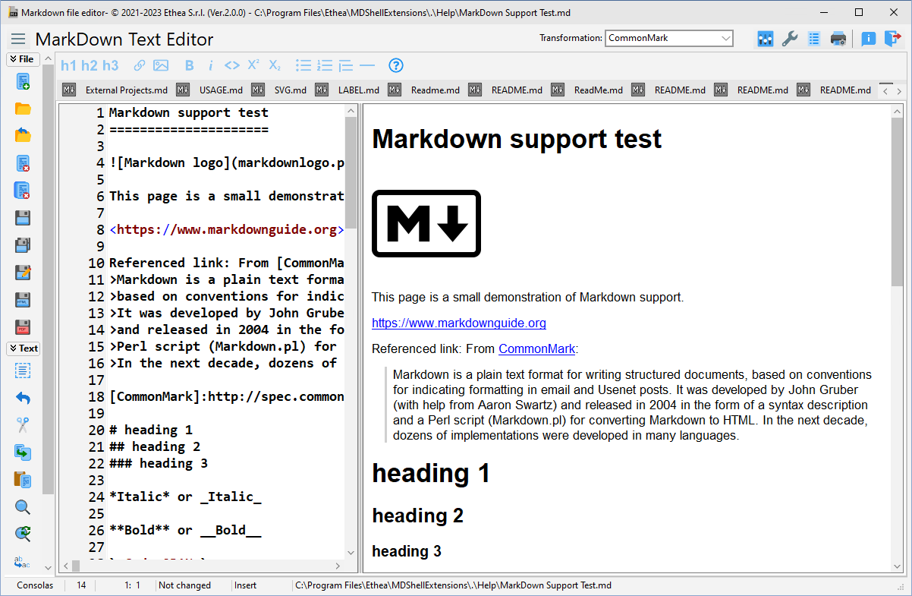

# Markdown Shell Extensions 

**Latest Version 1.4.0 - 11 Sep 2022**

**A collection of extensions tools for markdown files, integrated into Microsoft Windows Explorer (Vista, 7, 8 and 10):**

- A [Preview handler][1]  which allows you to see the content of the markdown file without open it, in the "Preview Panel".

- A [Markdown Text Editor][2] to manually edit with instant preview of markdown files.

### Features

- Supports Windows Vista, 7, 8, 10 and 11 (for 32 bits and 64 bits).

- Themes (Dark and Light) according to user preferences of Windows Theme

- Integrated also with other Shell Applications (like XYplorer)

### Setup using the Installer

Click to download the [MDShellExtensionsSetup.exe][3] located also in the Release area. The Installer works both for 32 and 64 bit system.

INFO: the installer is signed with a certificate!

***For a clean Setup close all the windows explorer instances which have the preview handler active or the preview handler was used (remember the dll remains in memory until the windows explorer was closed).***

### Preview Panel in action ###

In Windows 10 with Dark theme:

### Markdown Text Editor

A useful Text editor with instant preview of Markdown formatted content:

### Manual Build and Installation (for Delphi developers) ###

If you have Delphi 10.4 Sydney, you can manually build the project:

***Warning: To simplyfy build of the projects, some third parties libraries are located into ext folder***

To manually install the SVGShellExtensions.dll follow these steps:

1. Close all the windows explorer instances which have the preview handler active or the preview handler was used (remember the dll remains in memory until the windows explorer was closed).
  
2. If you have already used the installer uninstall the components from system.
     
3. To install manually the dll run the `Unregister_Register.cmd` (run-as-administrator): notice that you must change the path into cmd file.

## Release Notes ##

11 Set 2022: ver. 1.4.0
- Added Combobox for easy selection Markdown Dialect
- Fixed load file with blanks in content menu
- Fixed loading ANSI files

20 Jan 2022: ver. 1.3.0
- Added Support for Windows 11
- Fixed resize content

04 Sep 2021: ver. 1.2.0
- Added Support for Delphi 11
- Updated Image32 Lib

20 Jul 2021: ver. 1.1.0
- Added Image32 Lib to best rendering of SVG Images

06 Jul 2021
- First public release with setup

## Credits

Many thanks to **Rodrigo Ruz V.** (author of [theroadtodelphi.com][7] Blog) for his wonderful work on [delphi-preview-handler][8] from which this project has used a lot of code and inspiration.

## License

Licensed under the [Apache License, Version 2.0][9] (the "License");
Unless required by applicable law or agreed to in writing, software distributed under the License is distributed on an "AS IS" BASIS, WITHOUT WARRANTIES OR CONDITIONS OF ANY KIND, either express or implied. See the License for the specific language governing permissions and limitations under the License.

# External projects

***This project uses some External Projects, located into Ext Path***

- [SVGIconImageList]

- [Synedit]

- [VCL-Style-Utils]

- [delphi-markdown]

  ***To simpilfy compilation of projects they are added into ext folder***

1: https://github.com/EtheaDev/SVGIconImageList

2: https://github.com/SynEdit/SynEdit

3: https://github.com/RRUZ/vcl-styles-utils

4: https://github.com/grahamegrieve/delphi-markdown

Related links: [embarcadero.com][10] - [learndelphi.org][11]

[1]: https://docs.microsoft.com/en-us/windows/win32/shell/preview-handlers

[2]: https://github.com/EtheaDev/MarkdownShellExtensions/

[3]: https://github.com/EtheaDev/MarkdownShellExtensions/releases/latest/download/MDShellExtensionsSetup.exe

[4]: https://github.com/EtheaDev/SVGIconImageList

[5]: https://github.com/SynEdit/SynEdit

[6]: https://github.com/RRUZ/vcl-styles-utils

[7]: https://theroadtodelphi.com/

[8]: https://github.com/RRUZ/delphi-preview-handler

[9]: https://opensource.org/licenses/Apache-2.0

[10]: https://www.embarcadero.com/

[11]: https://learndelphi.org/
